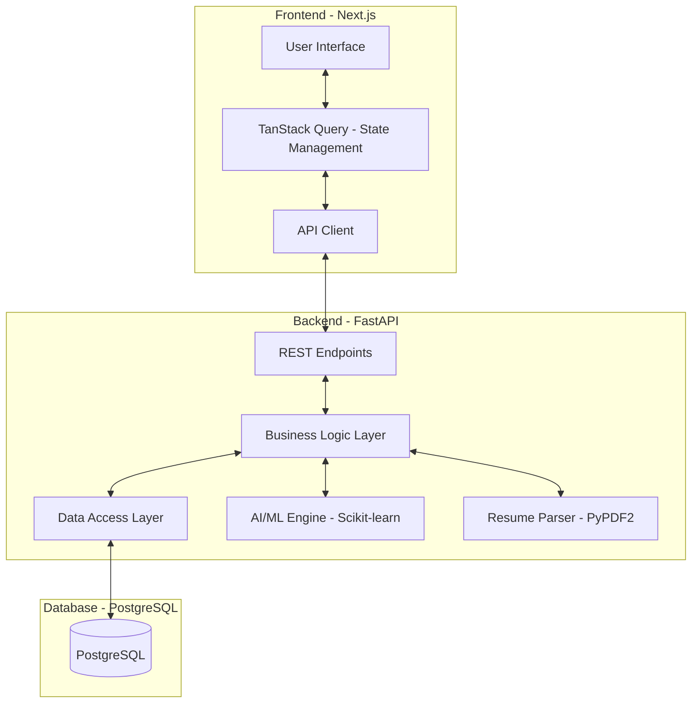
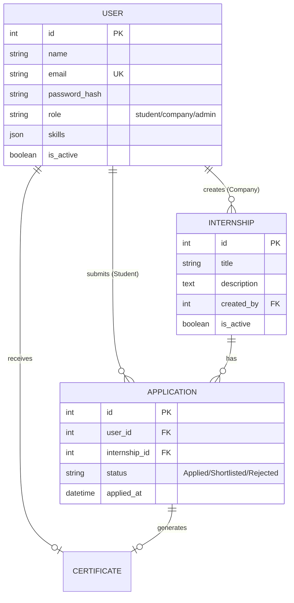
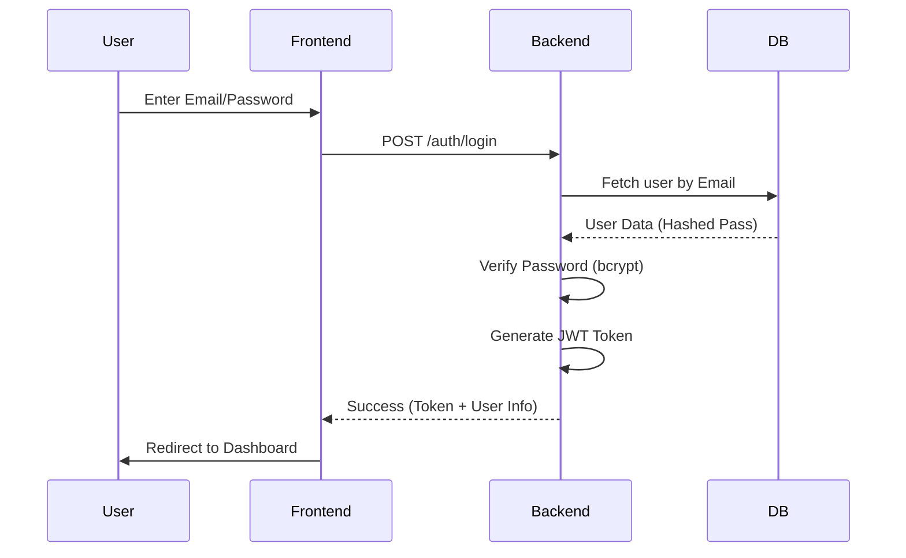
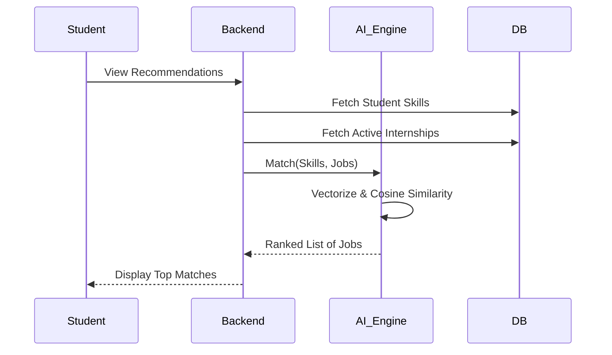

# System Design & Architecture: National Internship Portal

This document provides a comprehensive breakdown of the High-Level Design (HLD) and Low-Level Design (LLD) of the National Internship Portal.

---

## 1. High-Level Design (HLD)

The High-Level Design focuses on the overall architecture and how different layers of the system communicate. We use a **Decoupled Three-Tier Architecture**.

### 1.1 Architecture Diagram

### 1.2 Layer Explanation (Simple Language)
1.  **Frontend (Next.js)**: This is what the user sees. It's like the "skin" of the project. It handles how the buttons look, the animations, and it talks to the backend to get data.
2.  **Backend (FastAPI)**: This is the "brain." It receives requests from the frontend, checks if the user is logged in (security), runs the AI matching logic, and saves things to the database.
3.  **Database (PostgreSQL)**: This is the "memory." It permanently stores all user info, internship posts, and application history so they aren't lost when you refresh the page.

---

## 2. Low-Level Design (LLD)

LLD focuses on the internal structure of the components, specifically the database schema and the sequence of actions.

### 2.1 Database Schema (ER Diagram)

### 2.2 Core Workflows (Sequence Diagrams)

#### A. Authentication & Login Flow
How a user securely enters the system.

#### B. AI Recommendation Flow
How the system suggests the right jobs.

---

## 3. Detailed Flow Explanation (Simple Language)

### 3.1 The "Apply" Flow
1.  **Student Action**: The student finds a job they like and clicks "Apply."
2.  **Backend Check**: The backend checks if the student has already applied to this job (to prevent duplicates).
3.  **Creation**: A new "Application" record is created in the database with a status of `APPLIED`.
4.  **Notification**: The recruiter (company) immediately sees the new applicant on their dashboard.

### 3.2 The "Resume Parsing" Flow
1.  **Upload**: Student uploads a PDF resume.
2.  **Reading**: The backend "reads" the PDF and turns it into raw text.
3.  **Extracting**: The AI looks for keywords (like "Java", "Python", "React").
4.  **Saving**: These keywords are saved as "Skills" in the student's profile.
5.  **Updating**: The recommendation list automatically refreshes to show better jobs based on these new skills.

### 3.3 The "Delete Account" (Safety) Flow
1.  **Request**: User goes to the "Danger Zone" and clicks Delete.
2.  **Validation**: They must type their password and the word "DELETE."
3.  **Deactivation**: The system doesn't immediately erase everything (for safety); it just marks the user as "Inactive."
4.  **Cleanup**: If it's a company, all their job posts are automatically hidden so no one else applies to them.

---

## 4. Component Breakdown

| Component | Responsibility | Technology |
| :--- | :--- | :--- |
| **Auth Manager** | Login, Signup, and Permissions | JWT & Bcrypt |
| **Matching Engine** | Calculating how good a student is for a job | Scikit-learn (TF-IDF) |
| **File Server** | Storing and serving resumes safely | Local Storage / FastAPI |
| **State Manager** | Keeping the UI in sync with the DB | TanStack Query |
| **Router** | Navigating between pages (Home, Profile, etc.) | Next.js App Router |

---

## Conclusion
This design ensures that the National Internship Portal is **Scalable** (can handle more users), **Secure** (protects data), and **Intelligent** (provides smart matches). The use of HLD and LLD patterns guarantees a professional structure suitable for large-scale development.
